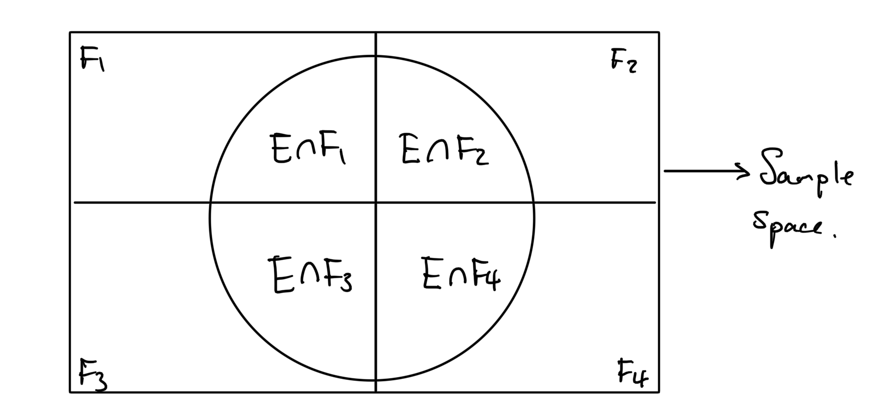
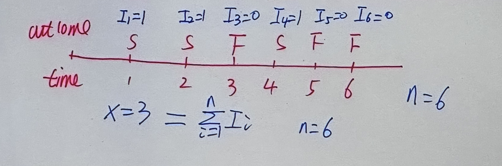
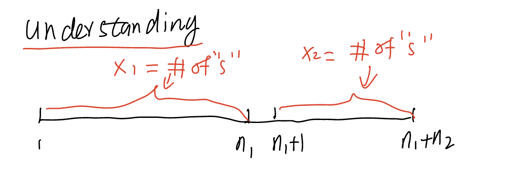
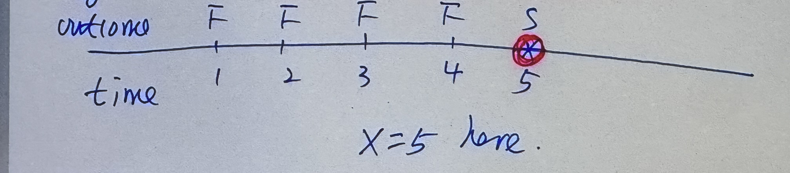
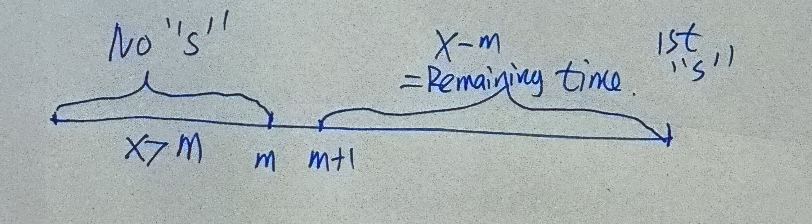
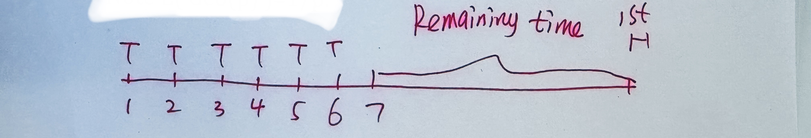

## Chapter 1: Introduction
We mainly cover:
1. Probability model
2. Commonly used random variables

### 1.1 Basic concepts of probability model
- Probability model
3 components of a probability model:
    - Sample space
    - Event
    - Probability function
- Sample space:
All possible outcomes of a random experiment.
    >e.g. Toss a coin twice: $S = \{(H,H), (H,T), (T,H), (T,T)\}$
- Event
Roughly speaking: Event = subset of the sample space.
    >e.g. E=$\{(H,H)\}$, subset of sample space $S$.
- Probability function
Notation $P$. Probability function is a function of event and satisfies 3 conditions:
    1. $0 \leq P(E) \leq 1$ for any event $E$
    2. $P($Sample Space$) = 1$
    3. Suppose $E_1, E_2, \dots$ are a sequece of disjoint events, i.e. $E_i \cap E_j = \emptyset$(empty set) for $i \neq j$. Then $P(\bigcup_{i=1}^{\infty} E_i) = \sum_{i=1}^{\infty} P(E_i)$ [Additivity Property]
        > e.g. Toss coin twice
        Define $P(E)=\frac{\text{\# of outcomes in }E}{4\text{ (Total \# of outcomes in sample space)}}$
        >>Exercise: Verify $P$ is a probablity function

- Property of probability function
    1. If $E_1 \subset E_2$, then $P(E_1) \leq P(E_2)$
        - If $E1$ occurs, then $E_2$ must occur $\implies E_1 \subset E_2$.
        - If $E_1$ implies $E_2$, then $E_1 \subset E_2$.
    2. If $E_1 \cap E_2 = \emptyset$, then $P(E_1 \cup E_2) = P(E_1) + P(E_2)$
    3. $P(\emptyset) = 0$
    4. $P(E) + P(E^c) = 1$
        - $E^c$ is the complementary of $E$.
    5. $P(E_1 \cup E_2) = P(E_1)+P(E_2)-P(E_1\cap E_2)$

- Independence
Two events $E$ and $F$ are independent if $P(E \cap F) = P(E) \cdot P(F)$ where $P(E \cap F)$ is the joint probability and $P(E) \cdot P(F)$ is marginal probabilities or unconditional probabilities.
so, independence means:

joint = product of marginals

- A useful result
Suppose we have a sequence of independent trials and a sequence of events $E_1, E_2, \dots$.
Now: $E_i$ only depends on $i$th trial $\implies$:
    1. all events $E_1, E_2, \dots$ are independent
    2. $P\left(\displaystyle \bigcap_{i=1}^{\infty} E_i\right)= \prod_{i=1}^{\infty} P(E_i)$
    2. $P\left(\displaystyle \bigcap_{i=1}^{m} E_i\right)= \prod_{i=1}^{m} P(E_i)$
    

>Example 1.1 (Independent Example):
Suppose the die is a fair die. If you repeatedly and independently toss a die, then you will get a sequence of numbers.
Find:
>1. $P($getting a "3" in the sequence of numbers$)$
    >>Solutions:
    >>Let $E$ = "3" in the sequence
    >>$E^C$ = No "3" in the sequence
    >>Then, $$P(E^C) = P(1\text{st} \neq 3 \cap 2\text{nd} \neq 3 \cap 3\text{rd} \neq 3 \cap \dots) \\ = \displaystyle \prod_{i=1}^\infty P(i\text{th} \neq 3) = \frac{5}{6}^\infty = 0$$
>2. $P($getting a "333" in the sequence of numbers$)$
Here we say "333” occurs on the $n$th toss if the $(n-2)$th outcome is "3”, $(n-1)$th outcome is "3”, and $n$th outcome is "3”.
>> Solution: Let $F$ = "333" in the sequence
>> $F^C$ = No "333" in the sequence
>> Idea: Create independent blocks of 3 tosses.
>> 
>> Note: $F^C$ implies that $\text{block }1 \neq "333", \text{block }2 \neq "333", \text{block }3 \neq "333", \dots \\ \implies F^C \subset \{\text{block }1 \neq "333", \text{block }2 \neq "333", \text{block }3 \neq "333", \dots\} \\ \implies P(F^C) \leq P(\text{block }1 \neq "333" \& \text{ block }2 \neq "333" \& \text{ block }3 \neq "333", \dots)\\ = \displaystyle \prod_{i=1}^{\infty}P(i\text{th block } \neq \text{"333"}) \\ = \prod_{i=1}^{\infty}1-P(i\text{th block } = \text{"333"})\\=\prod_{i=1}^{\infty}1-\left(\frac{1}{6}\right)^3=\frac{215}{216}^{\infty}=0$

>Example 1.2:
A coin is continually and independently tossed, where the probability of head (H) on a toss is $1/2$.
Find:
>1. $P(1$st two tosses give "HH"$)$
>>Solution: $P(1$st two tosses give "HH"$) = P(H)\cdot P(H) = \frac{1}{4}$
>2. $P(1$st two tosses give "TH"$)$
>>Solution: $P(1$st two tosses give "$TH"$) = P(T)\cdot P(H) = \frac{1}{4}$
>3. $P($"TH" occurs before "HH"$)$
>>Solution: 
    Case 1: Consider 1st outcome is "T", then "TH" occurs before "HH".
    Since to observe "TH", we need 1 "H", but to observe "HH", we need 2 "H"s.
    $P(\text{Case 1}) = \frac{1}{2}$
    Case 2: Consider 1st outcome is "H", 2nd outcome is "T", then "TH" occurs before "HH".
    $P(\text{Case 2}) = \frac{1}{4}$
    Case 3: Consider 1st outcome is "H", 2nd outcome is "H", then "HH" occurs before "TH".
    $P(\text{Case 3}) = \frac{1}{4}$
    $\implies P(\text{“TH” occurs before “HH”}) = P(\text{Case 1}) + P(\text{Case 2}) = \frac{3}{4}$

- Conditional Probability
Suppose $E$ and $F$ are two events with $P(F) > 0$. Then
$$P(E|F)=\frac{P(E \cap F)}{P(F)}$$
where $P(E|F)$ is the conditional probability, $P(E \cap F)$ is the joint probability, and $P(F)$ is the marginal probability.
    - Result 1: $P(E\cap F) = P(E|F)P(F)$ (Multiplication Rule)
    - Result 2: If $E$ and $F$ are independent, then $P(E|F) = P(E)$, i.e. conditional probability is the same as marginal probability.
    Proof idea: (not required) Use definition of independent and conditional.
    - Bayer's Formula:
        Suppose we have a sequence of events $F_1, F_2, \dots$ such that:
        1. $P(F_i) > 0$ for all $i$
        2. $F_i \cap F_k = \emptyset$ for all $i \neq j$
        3. $\bigcup_{i=1}^{\infty} F_i = S$

        Then, for any event $E$,
        1. $P(E) = \displaystyle \sum_{i=1}^{n} P(E\cap F_i) = \sum_{i=1}^{n} P(E|F_i)P(F_i)$ (Law of Total Probability)
        
        2. $P(F_k|E) = \displaystyle \frac{P(E\cap F_k)}{P(E)} = \frac{P(E|F_k)P(F_k)}{\sum_{i=1}^{n} P(E|F_i)P(F_i)}$ (Bayes' Formula)

> Example 1.3 (Monte Hall Problem):
> - There are three doors (say $A$, $B$, and $C$), behind which there are 2 goats and 1 car.
> - Monty knows the location of the car, but you do not.
> - You select a door at random (say $A$) and at this point your chance of winning the prize is $\frac{1}{3}$.
> - Then Monty opens one of the remaining two doors, either door $B$ or door $C$, to reveal a goat.
>
> Find $P(\text{winning the car if you switch the door})$.
>> Method 1:
>>
>>| |A|B|C| |
>>|---|---|---|---|---|
>>|Case 1|G|C|G|Monty will open door C|
>>|Case 2|G|G|C|Monty will open dooor B|
>>|Case 3|C|G|G|Monty will open either door B or door C
>>
>>$P(\text{winning if switch})=P(\text{Case 1})+P(\text{Case 2})=\frac{2}{3}$
>>
>> Method 2: Conditional Probability Idea
Suppose you choose door A and Monty opens door B (Event $E$).
Let $F_k = \text{car is behind door } k, k = A,B,C$
Then, $P(F_A) = P(F_B) = P(F_C) = \frac{1}{3}$
$P(\text{win if switch})=P(F_C|E)\\ = \frac{P(E|F_C)P(F_C)}{P(E|F_A)P(F_A)+P(E|F_B)P(F_B)+P(E|F_C)P(F_C)} \\ =\frac{1(\frac{1}{3})}{\frac{1}{2}(\frac{1}{3})+1(\frac{1}{3})} = \frac{2}{3}$

### 1.2 Random Variables (r.v.s)
- Definition of rv
rv is a function defined on sample space to real line.
$$X: S \rightarrow \mathbb{R}$$
- Two types of rv
    1. Discrete rv: all possible values are at most countable. (e.g. Binomial, Poisson)
    2. Continuous rv: all possible values contain an interval (e.g. Uniform)
- Review of important rvs:
    - Bernoulli Trials:
        1. Each trial has 2 outcomes: success (S) or failure (F)
        2. All trials are independent
        3. Probability of "S" on each trial is the same:
            $$P(\text{S}) = p, P(\text{F}) = 1-p$$
        - Bernoulli distribution: $\text{Bernoulli}(p)$
            Let $$I_i = \begin{cases}1 & \text{if "s" appears on the } i\text{th trial}\\0 & \text{otherwise}\end{cases}$$
            $P(I_i=1)=p$, $P(I_i=0)=q=1-p$, then $I_1, I_2, \dots$ are a sequence of iid (independent identically distributed) Bernoulli rvs.
        - Binomial rvs: $\text{Bin}(n,p)$
            $X = \text{\# of "S"s in } n \text{ bernoulli trials} \sim \text{Bin}(n,p)$ where $n$ is the number of trials and $p$ is the probability of success.
            1. Range: $\{0,1,2,\dots,n\}$
            2. Probability mass function (pmf): $P(X=k) = \binom{n}{k}p^k(1-p)^{n-k}$ for $k=0,1,2,\dots,n$
            3. Result 1: $X = \displaystyle \sum_{i=1}^{n} I_i$, where $I_1,..,I_n$are iid Bernoulli rvs.
            
            4. Result 2: If $X_1 \sim \text{Bin}(n_1,p) \text{ and } X_2 \sim \text{Bin}(n_2,p)$, and both of them are independent, then $X_1+X_2 \sim \text{Bin}(n_1+n_2,p)$.
            
            Then, $x_1+x_2=$ # of "s" in $n_1+n_2$ trials $\sim \text{Bin}(n_1+n_2,p)$
            Independent: No overlap between first $n_1$ trials and next $n_2$ trials.
        - Geometric rvs: $\text{Geo}(p)$
            (1st discrete waiting time rv)
            $X = \text{\# of trials to get 1st "s" in the sequence of Bernoulli trials}$ (including the trial to observe 1st "s").
            e.g.
            
            1. Range: $\{1,2,3,\dots\}$
            2. pmf: $P(X=k) = (1-p)^{k-1}p$ for $k=1,2,3,\dots$
            $E(X)=\frac{1}{p}$
            3. No-memory property: 
                $P(X>n+m|X>m) = P(X-m>n|X>m) = P(X>n)$ for $k,j=1,2,3,\dots$
                
                Formula tells us: Given that we do not observe Event "s", the remaining time $\sim \text{Geo}(p)$., same as the original time.

                >Example 1.4 (Geometric rv example):
                A fair coin is tossed repeatedly and independently. The objective is to observe the 1 st head. Let $X$ be the corresponding waiting time. Suppose we get 6 tails in the first 6 tosses.
                Note $E(\text{Geo}(p))=\frac{1}{p}$.
                >>i.e., $X \sim \text{Geo}(p=\frac{1}{2})$.
                
                >
                >Find:
                >1. $P (X=10 |\text{ the first 6 tosses give 6 tails})$.
                >>Solution: 
                $P (X=10 |\text{ the first 6 tosses give 6 tails})\\=P(\text{remainning time}) \\= (1-p)^{4-1}p\\=\left(1-\frac{1}{2}\right)^{4-1}\frac{1}{2}\\=\frac{1}{16}$
                >2. $E (X|\text{ the first 6 tosses give 6 tails})$.
                >>Solution:
                $E (X|\text{ the first 6 tosses give 6 tails})\\=E(6+\text{remainning time})\\=6+\frac{1}{p}\\=8$ 

            - Negtive Binomial $\text{NegBin}(r,p)$
                1. Range: $\{r,r+1,r+2,\dots\}$
                2. pmf: $P(X=k) = \binom{k-1}{r-1}p^r(1-p)^{k-r}$ for $k=r,r+1,r+2,\dots$（not required)
                3. Property: Let $X_1 = \text{Waiting time to observe 1st "s"},\\ X_2 = \text{Waiting time to observe 2nd "s" after 1st "s"},\\ ...,\\ X_r=\text{Waiting time to observe } r\text{th "s" after }  (r-1)\text{th "s"}$
                $X = \displaystyle \sum_{i=1}^{r} X_i \sim \text{NegBin}(r,p)$: $X_1,...X_r$ are iid $\text{Geo}(p)$ rvs.

                >Example 1.5 (Negative Binomial rv example)
                A fair coin is tossed repeatedly and independently. The objective is to observe the two heads in total. Let $X$ be the corresponding waiting time.
                Note $E(\text{Geo}(p))=\frac{1}{p}$.
                Find:
                >1. $E (X|\text{the first 3 tosses give “HTT”})$.
                >>Solution: 
                $E (X|\text{the first 3 tosses give “HTT”}) \\=E(3+\text{remainning time})\\=3+\frac{1}{p}\\=3+2\\=5$
                >2. $E (X|\text{the first 3 tosses give “TTT”})$.
                >>Solution:
                $E (X|\text{the first 3 tosses give “TTT”}) \\=E(3+\text{remainning time of } X_1+X_2)\\=3+\frac{1}{p}+\frac{1}{p}\\=7$
            
            - Poisson r.v. $\text{Pois}(\lambda)$
                Suppose $X \sim \text{Pois}(\lambda)$
                1. Range: $\{0,1,2,\dots\}$
                2. pmf: $P(X=k) = \frac{\lambda^ke^{-\lambda}}{k!}$ for $k=0,1,2,\dots$
                $\lambda =$ rate parameter / $E(X)=\lambda$
                3. Property:
                If $X_1 \sim \text{Pois}(\lambda_1)$ and $X_2 \sim \text{Pois}(\lambda_2)$, and both of them are independent, then $X_1+X_2 \sim \text{Pois}(\lambda_1+\lambda_2)$.
            
            - Exponential r.v.: $\text{Exp}(\lambda)$
                [continuous waiting time rv]
                1. probability density function (pdf): $f(x) = \begin{cases}\lambda e^{-\lambda x} & x > 0\\0 & \text{o.w.}\end{cases}$
                2. $\lambda =$ rate parameter / $E(X)=\frac{1}{\lambda}$
                3. Tail prob: $P(X>t)=e^{-\lambda t}=\int_t^{\infty}\lambda f(x)dx$ for $t>0$
                4. No memory property: $P(X>t+s|X>s)=P(\text{remaining time}>t|X>s)=P(X>t)$ for $s,t>0$
                Meaning: Given that we do not observe Event "s", the remaining time $\sim \text{Exp}(\lambda)$, same as the original time.

                >Example 1.6 (Exponential rv example)
                Suppose waiting time ($X$) for customers coming to Tim Hortons (T.H.) follows $\text{Exp}(2)$. Here 1 unit time = 1 minute. In the first 3 minutes, there is no customer.
                >> $\lambda = 2$, $X>3$.
                >
                >(a) Find the probability of no customer in the first 5 minutes.
                >> Solution: $P(X>5|X>3)=P(X>2)=e^{-4}$
                >
                >(b) $E (X|\text{no customer in the first 3 minutes})$.
                >> Solution: $E (X|\text{no customer in the first 3 minutes}) \\=E(3+\text{remainning time})\\=3+\frac{1}{\lambda}\\=3+\frac{1}{2}\\=3.5$
### 1.3 Expectation and Variance
- Discrete r.v. X
    Range: $\{x_1,x_2,\dots\}$
    $E(X) = \displaystyle \sum_{i=1}^{\infty} x_i P(X=x_i)$ = value * probability
    >e.g. $X \sim \text{Bernoulli}(p)$, Find $E(X)$.
    >Solution: $P(X=1)=p$, $P(X=0)=1-p$, $E(X)=1\cdot p+0\cdot(1-p)=p$